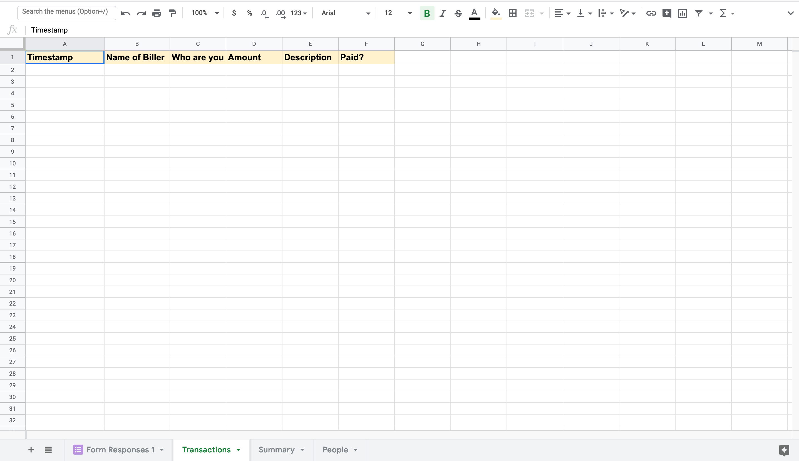
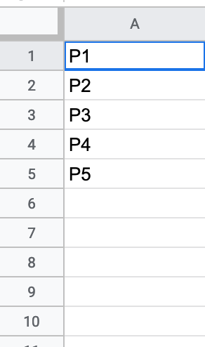
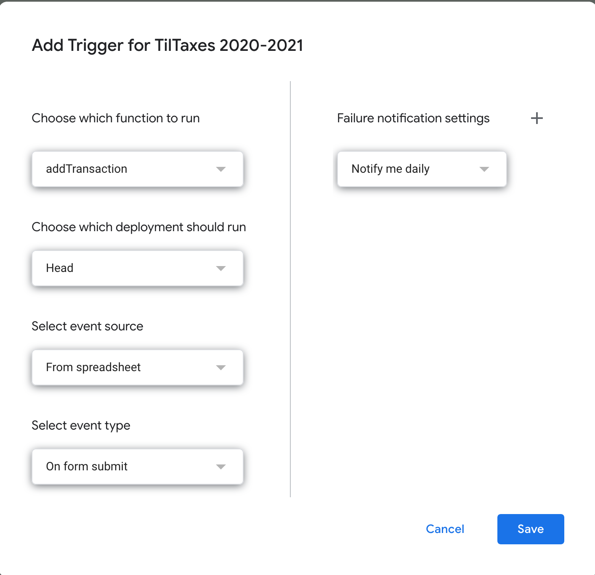

# Tiltaxes

### Google Sheets Script to track money exchanged among roomates or a community. 

## To use this project, complete the following steps. 

1. Make a Google Form in Google Drive. The form should have a field to enter the person billing, the people who are being billed, the amount, and a description of what is being charged. It can look something like the following:
   

2. Click the Response tab, and the Sheets logo at the top right of the tab to create a Spreadsheet from responses to the Form. Give it a suitable name.

3. The Sheets file will open in a new tab in the web browser. Next, you will need to make a Sheet titled "Transactions" exactly. The sheet should have six column headers as seen in the screenshot below. This is the sheet where all the transactions that are entered will be stored and tracked.
   

4. Create another sheet titled "Summary" exactly. No action required on this sheet.

5. Create another sheet titled "People" exactly. Enter the name of the people in your apartment / community in column A, and hit Enter after every name.
   

6. Go to the Google Forms taskbar at the top of the page and click: Tool > Script Editor. Delete the content of Code.gs and replace it with the code in this repository. Click save and name the project.

7. Navigate to https://script.google.com/home/. Navigate to My Projects and click the three dots to the far right associated with the project you just created. Click Triggers.

8. Click Add Trigger button at the bottom right of the page. Configure the Trigger as in the screenshot:
   

9. Click save and you will be directed to verify the script. When you get to the "This App isn't verified" page, click Advanced. Then click the link below to the project. Finally, hit the Allow button

10. You are ready to go. Send the Google Form to your roomates for them to fill out, and view the spreadsheet to view who owes who.

## Usage Note

- When a payment has been made, ensure that the paid field under transactions is updated. The value in this field causes the program to include the transaction in the Summary field or not.

